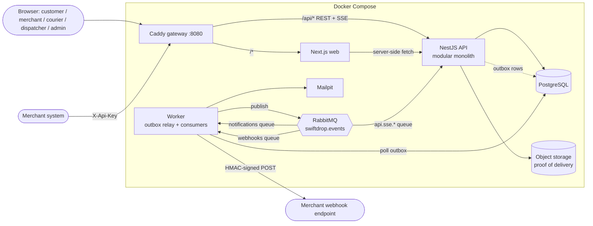
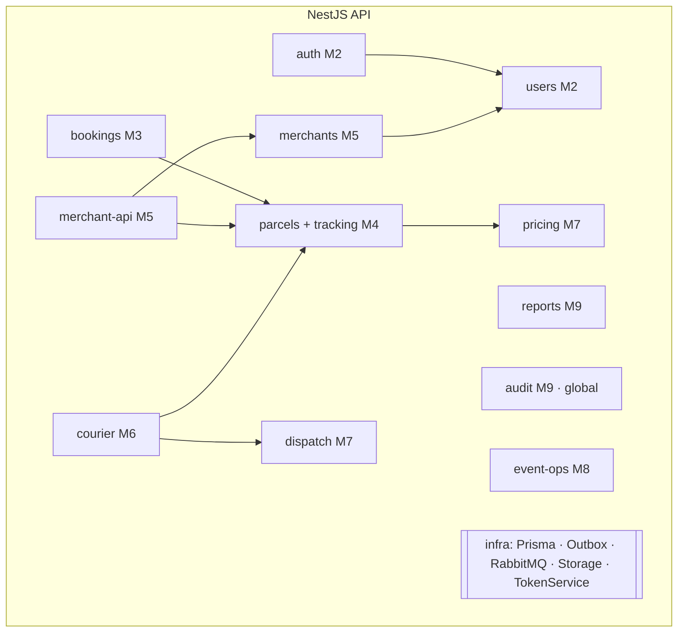

# Architecture diagrams

Owner: M1. Mermaid renders on GitHub. Export PNGs for the design PDF in Week 8.

## Containers

```mermaid
flowchart LR
  user([Browser: customer / merchant / courier / dispatcher / admin])
  partner([Merchant system])
  subgraph docker[Docker Compose]
    gw[Caddy gateway :8080]
    web[Next.js web]
    api[NestJS API\nmodular monolith]
    worker[Worker\noutbox relay + consumers]
    pg[(PostgreSQL)]
    mq{{RabbitMQ\nswiftdrop.events}}
    s3[(Object storage\nproof of delivery)]
    mail[Mailpit]
  end
  hook([Merchant webhook endpoint])

  user --> gw
  gw -- "/*" --> web
  gw -- "/api/*  REST + SSE" --> api
  web -- "server-side fetch" --> api
  partner -- "X-Api-Key" --> gw
  api --> pg
  api --> s3
  api -. "outbox rows" .-> pg
  worker -- "poll outbox" --> pg
  worker -- publish --> mq
  mq -- "notifications queue" --> worker
  mq -- "webhooks queue" --> worker
  mq -- "api.sse.* queue" --> api
  worker --> mail
  worker -- "HMAC-signed POST" --> hook
```

## API modules

```mermaid
flowchart TB
  subgraph api[NestJS API]
    auth[auth M2] --> users[users M2]
    bookings[bookings M3] --> parcels[parcels + tracking M4]
    merchantapi[merchant-api M5] --> merchants[merchants M5]
    merchantapi --> parcels
    merchants --> users
    courier[courier M6] --> parcels
    courier --> dispatch[dispatch M7]
    parcels --> pricing[pricing M7]
    reports[reports M9]
    audit[audit M9 · global]
    ops[event-ops M8]
    infra[[infra: Prisma · Outbox · RabbitMQ · Storage · TokenService]]
  end
```
