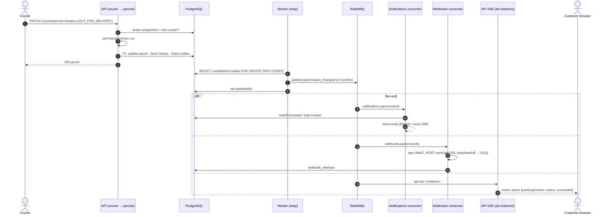
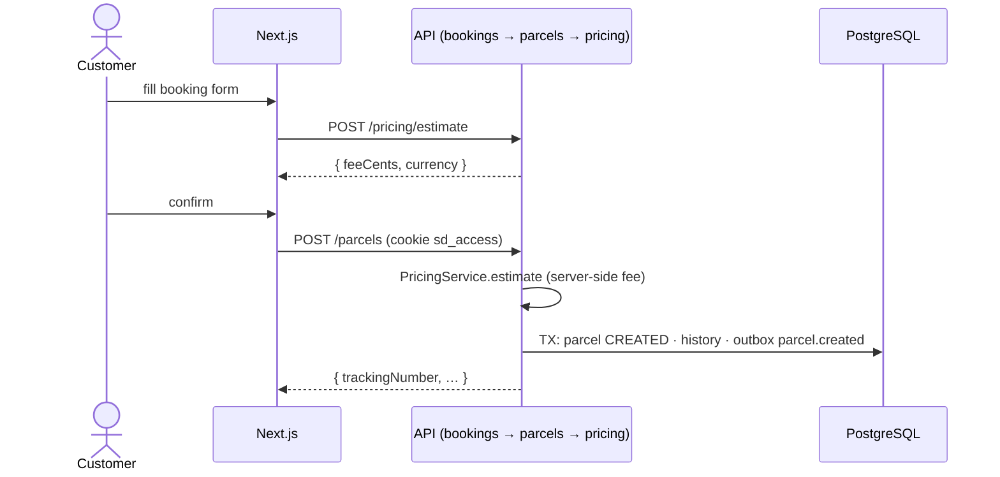
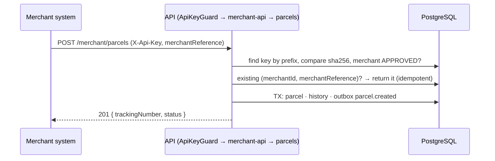

# Sequence diagrams

## Courier status update → tracking, notification, webhook

```mermaid
sequenceDiagram
  autonumber
  actor C as Courier
  participant API as API (courier → parcels)
  participant DB as PostgreSQL
  participant W as Worker (relay)
  participant MQ as RabbitMQ
  participant N as Notifications consumer
  participant WH as Webhooks consumer
  participant SSE as API SSE (all instances)
  actor B as Customer browser

  C->>API: PATCH /courier/parcels/:id/status {OUT_FOR_DELIVERY}
  API->>DB: active assignment = this courier?
  API->>API: canTransition(from, to)
  API->>DB: TX: update parcel · insert history · insert outbox
  API-->>C: 200 parcel
  W->>DB: SELECT unpublished outbox FOR UPDATE SKIP LOCKED
  W->>MQ: publish parcel.status_changed.v1 (confirm)
  W->>DB: set publishedAt
  par fan-out
    MQ->>N: notifications.parcel-events
    N->>DB: markProcessed / load contact
    N-->>N: send email (Mailpit) / mock SMS
  and
    MQ->>WH: webhooks.parcel-events
    WH->>WH: sign HMAC, POST merchant URL (retry/backoff → DLQ)
    WH->>DB: webhook_attempts
  and
    MQ->>SSE: api.sse.<instance>
    SSE-->>B: event: status {trackingNumber, status, occurredAt}
  end
```

## Customer booking

```mermaid
sequenceDiagram
  actor U as Customer
  participant Web as Next.js
  participant API as API (bookings → parcels → pricing)
  participant DB as PostgreSQL
  U->>Web: fill booking form
  Web->>API: POST /pricing/estimate
  API-->>Web: { feeCents, currency }
  U->>Web: confirm
  Web->>API: POST /parcels (cookie sd_access)
  API->>API: PricingService.estimate (server-side fee)
  API->>DB: TX: parcel CREATED · history · outbox parcel.created
  API-->>Web: { trackingNumber, … }
```

## Merchant API order

```mermaid
sequenceDiagram
  participant M as Merchant system
  participant API as API (ApiKeyGuard → merchant-api → parcels)
  participant DB as PostgreSQL
  M->>API: POST /merchant/parcels (X-Api-Key, merchantReference)
  API->>DB: find key by prefix, compare sha256, merchant APPROVED?
  API->>DB: existing (merchantId, merchantReference)? → return it (idempotent)
  API->>DB: TX: parcel · history · outbox parcel.created
  API-->>M: 201 { trackingNumber, status }
```
